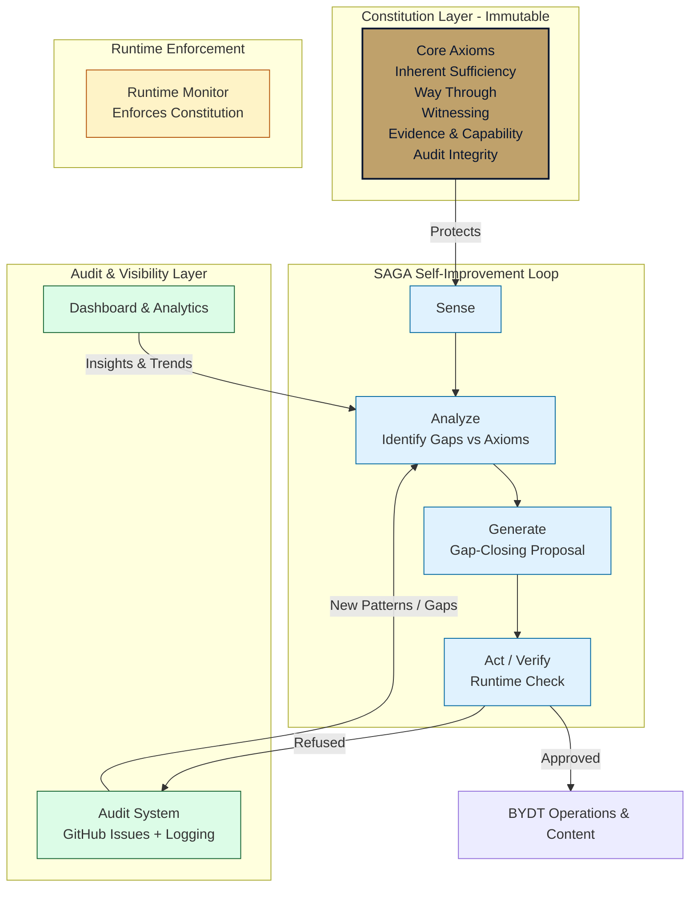

# ace-governed-systems

**Axiomatic Context Engineering** — Building governed, self-improving systems that stay aligned with their founding principles over time.

This repository contains the core artifacts, workflows, and documentation for a complete governed self-improvement system, originally developed for the BYDT (Build Your Dreaming Things) brand and projects.

## Core Philosophy

The system is built around five immutable core axioms:

- **Inherent Sufficiency** — Value exists before performance
- **Way Through** — Focus on capability, discernment, and imaginative power rather than rescue or outsourcing
- **Witnessing & Mature Presence** — Prioritize presence and relational maturity
- **Evidence & Capability** — Favor real capability over aspiration theater
- **Audit Integrity** — Maintain full lineage and accountability

These axioms are protected. Everything else in the system is designed to evolve safely around them.

## Architecture Overview

The system follows a protected self-improvement loop with verification and feedback:

### Key Components

| Component                    | Purpose                                                                 | Key Files / Workflows                          |
|-----------------------------|-------------------------------------------------------------------------|------------------------------------------------|
| **Constitution**            | Defines immutable core axioms and mutable operational layer            | `IMMUTABLE_VS_MUTABLE_LAYERS.md`              |
| **SAGA Loop**               | The self-improvement engine (Sense, Analyze, Generate, Act)            | `governed_systems_SOP_PFMEA_DFMEA.md`         |
| **Runtime Monitor**         | Enforces rules at execution time                                        | `RUNTIME-MONITOR-WIRING.md`                   |
| **Audit System**            | Logs all significant actions and refusals                               | GitHub Issues + `audit-processor.yml`         |
| **Dashboard**               | Visual overview of system health and refusal patterns                   | `docs/index.html` + `generate-audit-dashboard.yml` |
| **Cleanup Automation**      | Automatically removes old artifacts and workflow runs                   | `cleanup-old-artifacts-and-runs.yml`          |
| **Formal Verification**     | Mathematical proofs that certain failures are impossible                | TLA+ specs (earlier work)                     |
| **AGE Engineer Agent**      | Claude Code session agent: triages FMEA rows, designs solutions, manages lifecycle, generates proposals, analyzes PR risks | `CLAUDE.md` + `AGE-WORKBENCH.md` + `scripts/age_engineer.py` + `.github/workflows/age-*.yml` |

### Data Flow

1. The **Runtime Monitor** checks actions against the constitution.
2. Significant events are logged as structured **GitHub Issues** (labeled `audit`).
3. The **Audit Processor** workflow processes new issues and can auto-generate gap-closing proposals.
4. The **Dashboard Generator** maintains `AUDIT-DASHBOARD.md` and `dashboard-data.json`.
5. The visual dashboard shows live metrics and trends.
6. Old data is cleaned up automatically.

## Live Dashboard

**https://honoryourexperiences.github.io/ace-governed-systems/**

Shows real-time(ish) audit metrics including refusal rates and top reasons.

**Executive Decision Report:** https://honoryourexperiences.github.io/ace-governed-systems/executive-report.html

Plain-language GREEN/YELLOW/RED decision view for AGE governance rows, with evidence links.

## Key Files & Folders

- `FOUNDER-COCKPIT.md` — **Start here.** Daily entry point: current status, one next action, time budget.
- `FOUNDER-MORNING-RUNBOOK.md` — Current wake-up sequence and human-only action queue after the latest audit.
- `FOUNDER-WEEKLY-REFLECTION.md` — Weekly SAGA-structured founder self-check (including Way Through self-assessment).
- `proposals/` — Active and historical SAGA / AGE governance proposals for the overall governed system
- `governed_systems_SOP_PFMEA_DFMEA.md` — Living procedures and risk analyses
- `IMMUTABLE_VS_MUTABLE_LAYERS.md` — Core governance rules
- `AUDIT-DASHBOARD.md` — Auto-generated human-readable dashboard
- `docs/` — GitHub Pages dashboard source
- `.github/workflows/` — All automation (audit processing, dashboard generation, cleanup)
- `cape-able-heroes/PRE-SESSION-SIGNALS.md` — Tracks the gap between zero and Session 1
- `cape-able-heroes/DECISION-LOG.md` — Lightweight record of judgment calls made during development
- `cape-able-heroes/proposals/` — Cape-Able Heroes offer-development proposals, separate from root governance proposals

## Status

The core governance system is functional and includes:
- Protected core axioms
- Automated audit logging
- Self-updating dashboard
- Scheduled cleanup
- Formal error handling in workflows

The system is designed to reduce manual oversight while making misalignment visible and actionable.
